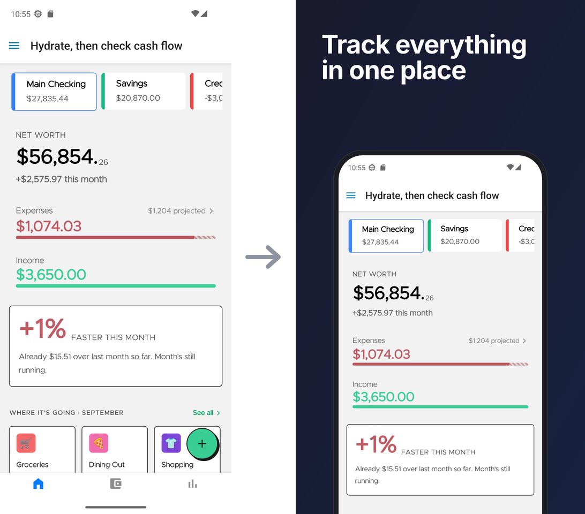

<h1 align="center">showpiece</h1>

<p align="center">
  <strong>Your app changed. Your Play Store screenshots did not.</strong><br/>
  One command captures, frames and publishes them. 📸
</p>

<p align="center">
  <a href="https://github.com/MrCordeiro/showpiece/actions/workflows/ci.yml"></a>
  <a href="https://www.npmjs.com/package/showpiece"></a>
  <a href="LICENSE"></a>
</p>



<!-- TODO: demo GIF of capture → frame → publish --dry-run -->

|    | showpiece |
| -- | --------- |
| 📱 | **Works with the build you have.** A debug build, an Expo dev client or last month's APK. No 30-minute production build. |
| 🖼️ | **Frames them for you.** A caption, a phone and your colours. No Figma file to keep up to date. |
| 🚀 | **Publishes to Google Play.** It replaces the listing screenshots. `--dry-run` checks everything and changes nothing. |
| 🎯 | **Same pixels every time.** Your laptop and CI make byte-identical images. |
| 🩺 | **Tells you why a flow failed.** Diagnostics for each screen, and an agent skill that reads them and repairs the flow. |
| 🛡️ | **Never cancels a review.** Your pending release stays pending. |

## Why showpiece?

Every release had the same job at the end: open the emulator, go to each screen, take a screenshot, put it in a design tool, export it, and upload it in Play Console. Then the app changed again, and the screenshots were wrong again.

The usual tools need a production build, a design tool, or fastlane and Ruby. My production build takes 30 minutes. I wanted a tool that uses the build that is already on the emulator.

So showpiece uses [Maestro](https://maestro.mobile.dev) to go to each screen, [sharp](https://sharp.pixelplumbing.com) to frame the screenshots, and the Play Developer API to publish them. One config file says which screens you want and what each caption says.

If you change your screenshots once a year, the Play Console upload is fine. showpiece is for apps that change every sprint.

## How it works

```txt
showpiece.config.ts ──► showpiece capture ──► .showpiece/screenshots/raw/*.png
                        showpiece frame   ──► .showpiece/screenshots/framed/*.png
                        showpiece publish ──► Google Play listing
```

Each command runs on its own and uses the same config file.

## Requirements

- Node.js 22.12 or later
- [`maestro`](https://maestro.mobile.dev/getting-started/installing-maestro) on your PATH. Maestro needs a Java runtime.
- Android platform-tools (`adb`) on your PATH
- `ANDROID_HOME` (or `ANDROID_SDK_ROOT`), if you want showpiece to boot an AVD for you

## Install

```bash
npm install --save-dev showpiece
```

## Quickstart

1. Create `showpiece.config.ts` at the root of your app repo:

   ```ts
   import { defineConfig } from "showpiece";

   export default defineConfig({
     app: { packageName: "com.example.myapp" },
     device: { avd: "Pixel_7_API_34" },
     frame: { template: "gradient", background: ["#1a1a2e", "#16213e"], textColor: "#ffffff" },
     publish: { serviceAccountKeyPath: "./.envs/play-service-account.json" },
     screens: [
       { id: "home", flow: ".showpiece/flows/home.yaml", caption: "Track everything in one place" },
       { id: "profile", flow: ".showpiece/flows/profile.yaml", caption: "Your data, your way" },
     ],
   });
   ```

2. Write one Maestro flow for each screen. The `takeScreenshot` name must equal the screen `id`:

   ```yaml
   # .showpiece/flows/home.yaml
   appId: com.example.myapp
   ---
   - launchApp
   - extendedWaitUntil:
       visible: "Home"
       timeout: 60000
   - takeScreenshot: home
   ```

3. Start Metro (`npx expo start`) if you capture a debug build or a dev client. Then run:

   ```bash
   npx showpiece capture            # writes .showpiece/screenshots/raw/
   npx showpiece frame              # writes .showpiece/screenshots/framed/
   npx showpiece publish --dry-run  # validates the listing on Play, then deletes the change
   ```

`publish` needs a service account. See [Publish setup](#publish-setup). The [`example/`](example/) folder has a complete config and three flows.

## Configure

All the config fields:

```ts
import { defineConfig } from "showpiece";

export default defineConfig({
  app: {
    packageName: "com.example.myapp",
    // apkPath: "./builds/app-release.apk", // optional; omit it if the app is already installed
  },
  device: {
    avd: "Pixel_7_API_34",
    locale: "en-US",
    devServer: true, // Metro-backed dev build; false for a standalone APK
    metroPort: 8081,
  },
  frame: {
    template: "gradient",
    background: ["#1a1a2e", "#16213e"],
    textColor: "#ffffff",
    font: "Metropolis",          // or "Inter"
  },
  publish: {
    serviceAccountKeyPath: "./.envs/play-service-account.json",
    track: "listing",
    listing: ["profile.png", "home.png"], // optional; see Publish
  },
  appearance: "light",
  screenshotsDir: ".showpiece/screenshots", // optional; this is the default
  screens: [
    {
      id: "home",
      flow: ".showpiece/flows/home.yaml",
      caption: "Track everything in one place",
      subtitle: "Every account, one screen", // optional
      background: "#3ccf91",                 // optional; overrides frame.background
      textColor: "#1a1a1a",                  // optional; overrides frame.textColor
    },
    { id: "profile", flow: ".showpiece/flows/profile.yaml", caption: "Your data, your way" },
  ],
});
```

showpiece accepts `.ts`, `.js`, `.mjs` and `.json` config files. All paths in the config are relative to the config file.

Flows and generated screenshots are in `.showpiece/` at your repo root. This folder belongs to showpiece only, so it does not conflict with your app's folders. Commit `.showpiece/flows/`. Add the generated output to `.gitignore`:

```gitignore
.showpiece/screenshots/
.showpiece/diagnostics/
```

## Writing flows

showpiece is **not** a Maestro test runner. A flow goes to one screen in a known state and calls `takeScreenshot` once. Two rules:

1. **The `takeScreenshot` name must equal the screen `id`.** showpiece checks this before it runs the flow, and shows a clear error when they do not match.
2. **Use deterministic state** (`clearState: true`, fixed demo data), so a second run gives the same screen.

```yaml
# .showpiece/flows/home.yaml
appId: com.example.myapp
---
- launchApp:
    clearState: true
- assertVisible: "Home"   # readiness gate, not the flow's purpose
- takeScreenshot: home    # name === screen id
```

`frame` shows only the top ~70% of each screenshot. Put the important content in the top two-thirds of the screen.

### Expo Router: deep-link to screens

If your app uses [Expo Router](https://docs.expo.dev/router/introduction/), every route is a URL. A deep link to a screen is more deterministic than taps through the UI, and it continues to work after a navigation refactor. Use deep links when you can.

Set a scheme in `app.json` (`{ "expo": { "scheme": "myapp" } }`). Expo Router makes the link paths from your file routes:

| Route file | Deep link |
| --- | --- |
| `app/index.tsx` | `myapp://` |
| `app/(tabs)/home.tsx` | `myapp://home`  *(the `(tabs)` group is omitted)* |
| `app/settings/account.tsx` | `myapp://settings/account` |
| `app/user/[id].tsx` | `myapp://user/42` |
| `app/search.tsx` | `myapp://search?q=trees` |

```yaml
# .showpiece/flows/profile.yaml: open the route directly, then capture
appId: com.example.myapp
---
- launchApp:
    clearState: true
- openLink: myapp://profile
- extendedWaitUntil:        # waits for async screens (vs. failing instantly)
    visible: "Your data, your way"
    timeout: 10000
- takeScreenshot: profile
```

Notes:

- A **dev-client** build registers the custom scheme, so `myapp://…` works with the installed build. (Expo Go uses `exp://` and is not supported.) Test the link once with:
  `adb shell am start -a android.intent.action.VIEW -d "myapp://profile" com.example.myapp`
- Send ids and parameters in the URL (`myapp://user/42`) to show stable demo data, so a second run gives the same screen.
- For screens without a route (modals, bottom sheets), use `tapOn: { id: "your-testID" }`. Use `testID` selectors, not visible text.
- If a screen has an entry animation, add `waitForAnimationToEnd` before `takeScreenshot`.

`example/.showpiece/flows/` has a deep link (`profile.yaml`), a nested route (`settings.yaml`) and a flow that starts from `launchApp` (`home.yaml`).

## Capture

```bash
npx showpiece capture                         # capture every configured screen
npx showpiece capture --only home,profile     # capture a subset
npx showpiece capture --serial emulator-5554  # use a specific device
npx showpiece capture --appearance dark       # capture in dark mode
npx showpiece capture --clean                 # empty raw/ first (for example, to remove old screens)
npx showpiece capture --config ./path/to/showpiece.config.ts
```

What it does:

1. Loads and validates the config.
2. Finds a running emulator with `adb devices`. If there is none, it boots the configured AVD and waits until the boot is complete.
3. Installs `apkPath` (`adb install -r`) if it is set. If not, it checks that the package is installed.
4. For a dev build (`device.devServer: true`), forwards the Metro port with `adb reverse` and checks that Metro runs (see below).
5. Puts the status bar in Android demo mode: the clock shows 9:30, signal and battery are full, and notification icons are hidden. After the run, it exits demo mode and restores the `sysui_demo_allowed` setting. If the device does not support demo mode, capture shows a warning and continues with the real status bar.
6. Runs the flow of each screen in config order. It writes `.showpiece/screenshots/raw/<id>.png` and the diagnostics of each screen to `.showpiece/diagnostics/<id>/` (see [Troubleshooting](#troubleshooting)).
7. Prints a summary table and the path of the run report. It exits with a non-zero code if a screen failed.

Capture works with **any installed build**. It never needs a production build.

`raw/` keeps files from earlier runs. A run writes the PNGs of the screens that it captured only. It deletes a PNG only when the flow of that same screen failed, so `frame` and `publish` never use an image from a failed capture.

## Capturing a Metro-backed debug build

This is the primary use case: a build that loads its JS bundle from the **Metro** bundler at runtime. Examples are a plain `npx expo run:android` debug build and an Expo **dev client**. These builds do not contain the bundle. If the app cannot connect to Metro, it stops on the splash screen, and every capture shows the splash screen.

showpiece configures the connection when `device.devServer` is `true` (the default):

1. It runs `adb reverse tcp:<metroPort> tcp:<metroPort>`, so the emulator can connect to Metro on your computer.
2. It makes the app connect to Metro through `localhost`, not through the emulator's default `10.0.2.2` address. Large bundle downloads through `10.0.2.2` can become corrupt with no error, and the app then stops on the splash screen. showpiece writes `debug_http_host` into the app's SharedPreferences with `adb shell run-as`. This does not need `adb root`, so it works with any debuggable build.
3. It requests `http://127.0.0.1:<metroPort>/status`. If Metro does not answer, the command stops with a message that tells you what to do.

You start Metro yourself:

```bash
# terminal 1: in your app repo, keep it open
npx expo start            # or: npx expo run:android (builds and starts Metro)

# terminal 2
npx showpiece capture
```

Flow rules for Metro-backed debug builds:

- **Do not use `launchApp: { clearState: true }`.** On a dev-client build, it deletes the saved Metro URL and opens the dev launcher. On a plain debug build, it deletes onboarding and login state, and the app opens its first-run screens. Use a plain `- launchApp`. If your app has onboarding, complete it once by hand on the installed build. (Use `clearState` only for standalone builds, below.)
- **Wait for an element of your app, with a long timeout.** The first bundle load from Metro can take 10–60 s. Wait for a `testID` that only your app shows, not for splash text:

  ```yaml
  - launchApp
  - extendedWaitUntil:
      visible: { id: "home-screen" }
      timeout: 60000
  - takeScreenshot: home
  ```

- If a dev-client build opens the launcher, load the bundle with a link instead of `launchApp`: `- openLink: "myapp://expo-development-client/?url=http://localhost:8081"`.

**Standalone builds:** for a release or preview APK that contains the bundle (for example `expo run:android --variant release`, or an EAS `preview` build), set `device.devServer: false`. showpiece then does not configure Metro.

## Frame

```bash
npx showpiece frame                       # frame every configured screen
npx showpiece frame --only home,profile   # frame a subset
npx showpiece frame --config ./path/to/showpiece.config.ts
```

What it does:

1. Loads and validates the config.
2. For each selected screen, reads `.showpiece/screenshots/raw/<id>.png`, `.showpiece/screenshots/raw/<id>-dark.png` or both (see [Dark mode](#dark-mode)). It makes a 1080×1920 PNG from each file in `.showpiece/screenshots/framed/`.
3. A screen with no raw file fails with a message that tells you to run `showpiece capture` first. The other screens continue.
4. Prints a summary table. It exits with a non-zero code if a screen failed.

Every template uses the same layout. A left-aligned headline (the screen's `caption`) and an optional `subtitle` are at the top. A large device is below them, at the same position on every screen. The device continues below the bottom edge, so only the top ~70% of each screenshot is visible.

A headline with a subtitle has at most 2 lines. A headline without a subtitle uses the subtitle's space: it can have 3 lines and a larger size. `frame` calculates one headline size for the screens with a subtitle, one for the screens without, and one subtitle size. It uses every screen in the config for this calculation, also when you use `--only`, so each group has the same size on every screen.

Three templates (`frame.template` in the config):

| Template | Device |
| --- | --- |
| `gradient` | A flat, stylized phone outline on a two-stop gradient background. |
| `solid` | The same as `gradient`, on a flat background colour. |
| `minimal` | No bezel: the screenshot with rounded top corners and a soft shadow. |

The bezel is near-black. On a near-black background, it is dark grey with a lighter edge, so the outline stays visible.

`frame` gives the same result on every machine and in CI. A second run on the same raw screenshots gives byte-identical PNGs, because:

- The code generates the device bezel. It is not an image file.
- The text is SVG glyph paths from the bundled fonts in `assets/fonts/`: Metropolis (the default, Unlicense) and Inter (SIL OFL 1.1). showpiece does not use system fonts.

The layout follows the general App Store screenshot practices in [this guide](https://www.lappka.store/blog/app-store-screenshot-best-practices): one short caption about a benefit on each screen, the same device on every screen, and the same colours across the set.

## Dark mode

Set the UI mode for the capture in the config, or for one run:

```ts
// showpiece.config.ts
appearance: "dark",   // "light" (default) | "dark"
```

```bash
npx showpiece capture                       # uses the configured appearance
npx showpiece capture --appearance dark     # overrides it for one run
```

showpiece adds a `-dark` suffix to dark-mode screenshots, so both sets can exist together:

```txt
.showpiece/screenshots/raw/home.png        # light
.showpiece/screenshots/raw/home-dark.png   # dark
```

To capture both, do two runs with the same config, in any order. The second run adds its files and does not change the files of the first run:

```bash
npx showpiece capture --appearance light
npx showpiece capture --appearance dark
```

showpiece runs `adb shell cmd uimode night <yes|no>` before the flows, and restores the previous mode of the device after them. To read and restore the mode, the device needs Android 10 (API 29) or later. On older system images, showpiece does not change the mode and shows a warning.

> **Your app must follow the system appearance.** In Expo, set `"userInterfaceStyle": "automatic"` (or `"dark"`) in `app.json`. The default is `"light"`, which ignores the system setting: you get light screenshots with `-dark` names.

## Publish setup

`publish` uses a Google Cloud service account with a JSON key. An API key does not work: the Play Developer API accepts only a service account for listing changes. Do this setup once for each app:

1. In a Google Cloud project, enable the **Google Play Android Developer API** (`androidpublisher.googleapis.com`).
2. Create a service account. Do not give it IAM roles. The Play permissions are in Play Console, not in Google Cloud IAM.
3. Create a JSON key for the service account. Save it at the path in `publish.serviceAccountKeyPath`, for example `./.envs/play-service-account.json`.
4. Add the key's folder to `.gitignore`. Do not commit or share the key.
5. In Play Console, open **Users and permissions** and invite the service account by its email.
6. Give the account **Manage store presence** for the app.
7. Wait a few minutes, then run `npx showpiece publish --dry-run`.

<details>
<summary>Steps 1–4 with OpenTofu or Terraform</summary>

The state file of this configuration contains the private key. Do not commit or share the state file.

```hcl
terraform {
  required_providers {
    google = { source = "hashicorp/google", version = "~> 6.0" }
    local  = { source = "hashicorp/local", version = "~> 2.5" }
  }
}

variable "project_id" { type = string }

provider "google" {
  project = var.project_id
}

resource "google_project_service" "androidpublisher" {
  service            = "androidpublisher.googleapis.com"
  disable_on_destroy = false
}

resource "google_service_account" "showpiece" {
  account_id   = "showpiece-publisher"
  display_name = "showpiece Play listing publisher"
}

resource "google_service_account_key" "showpiece" {
  service_account_id = google_service_account.showpiece.name
}

resource "local_sensitive_file" "key" {
  content_base64  = google_service_account_key.showpiece.private_key
  filename        = "${path.root}/../.envs/play-service-account.json"
  file_permission = "0600"
}

output "service_account_email" {
  value = google_service_account.showpiece.email
}
```

</details>

## Publish

```bash
npx showpiece publish --dry-run  # upload and validate, then delete the edit
npx showpiece publish            # show the listing, ask for confirmation, then commit
npx showpiece publish --yes      # commit without the question (for scripts)
```

`publish.listing` in `showpiece.config.ts` sets which screenshots `publish` uploads. The order of the array is the order of the screenshots on the store listing.

```ts
publish: {
  serviceAccountKeyPath: "./.envs/play-service-account.json",
  listing: [
    "home.png",                          // a file in .showpiece/screenshots/framed/
    "budget-dark.png",                   // light or dark, per entry
    "./marketing/budget-highlighted.png", // an image that showpiece did not make
  ],
},
```

- A name without a path is a file that `frame` made: `<id>.png` or `<id>-dark.png`. The editor shows typos before you run the command.
- A path that starts with `./` or `../` is an image that showpiece did not make, for example a framed image that you edited in Photoshop. showpiece finds the file relative to `showpiece.config.ts` and uploads it to Play without changes.
- If `listing` is not set, `publish` uses every screen in config order, in the configured `appearance`.

`publish` edits the listing of `app.packageName`. If you capture a dev build with a different package name (for example `com.example.myapp.dev`), set `publish.packageName` to the package name of the app on Google Play:

```ts
app: { packageName: "com.example.myapp.dev" },  // the build that capture opens
publish: {
  serviceAccountKeyPath: "./.envs/play-service-account.json",
  packageName: "com.example.myapp",            // the app whose listing publish edits
},
```

### What it does

1. Prints the listing as a numbered table. Each entry has a status:

   | Status      | Meaning | Stops the run |
   | ----------- | ------- | ------------- |
   | `ok`        | Ready to upload. | No |
   | `stale`     | The raw screenshot or the config changed after `frame`, or someone edited the framed file. Run `showpiece frame` to update it. | No |
   | `missing`   | The file does not exist, or the name does not match a screen. The table suggests a similar name. | Yes |
   | `too large` | The file is larger than 8 MB. | Yes |
   | `invalid`   | The file is not PNG or JPEG, has an alpha channel, or has incorrect dimensions. | Yes |

2. Asks `Commit <n> screenshots to <package>? [y/N]`. `--yes` skips the question. `--dry-run` does not ask.
3. Creates a Play edit, replaces the phone screenshots for `device.locale`, and validates the edit.
4. With `--dry-run`, deletes the edit. Otherwise, commits it. Google reviews the change before it goes live.

`publish` never cancels changes that are in review on Play. If your release or an earlier listing change is still in review, `publish` stops with `E_PUBLISH_IN_REVIEW`. Run it again after Google approves the change.

`frame` writes `.showpiece/screenshots/framed/manifest.json`, and `publish` uses it to find stale images. Do not edit this file.

## Troubleshooting

Every screen that a run tries to capture, successful or not, gets a diagnostics folder at `.showpiece/diagnostics/<id>[-dark]/`. Every run writes a summary to `.showpiece/diagnostics/last-run.json`:

```txt
.showpiece/diagnostics/
  last-run.json               status, error code and path of each screen in the last run
  home/
    context.json               showpiece's own record: flow, serial, exitCode, status, timestamp
    commands.json              Maestro's log of each step
    failure-screenshot.png     the screen at the failed step (failures only)
    hierarchy.json             the view hierarchy after the flow ended
    maestro.log                Maestro's own log
    maestro-stdout.log         stdout and stderr of the maestro process
    crash-signals.log          the crash lines from logcat: native crashes, Java exceptions, process death
    logcat.txt                 the full device logcat during the attempt
```

After a failure, showpiece also checks whether the app's process is still alive. For Maestro, a stopped bundle download and a crashed app look the same: an assertion that never becomes true. The process check is the only reliable way to tell them apart. A dead process gives `E_APP_CRASHED`, and the evidence is in `crash-signals.log`. You do not get a general assertion failure that makes you look for a selector bug that does not exist.

The summary table also shows the diagnostics path of each failed screen:

```txt
Capture summary
---------------
✗ home  Step failed: assertVisible: Home after 10.0s (FAILED). See ...
        → diagnostics: .showpiece/diagnostics/home

1 screen(s) · 0 captured · 1 failed
```

Each failure has a code (`E_FLOW_CONVENTION`, `E_FLOW_FAILED`, `E_METRO_UNREACHABLE`, `E_APP_NOT_INSTALLED`, …) in the summary and in `last-run.json`.

## Let an agent fix failed flows

showpiece includes the `showpiece-flows` skill. The skill is one Markdown file. It contains showpiece's flow rules, the diagnostics layout above, and a table from each error code to its fix. With it, a coding agent in your repo can read the evidence of a failed run and repair the flow or `showpiece.config.ts`.

```bash
npx showpiece skill install          # writes .claude/skills/showpiece-flows/SKILL.md
npx showpiece skill install --force  # replaces an installed copy
```

Claude Code finds the skill automatically, but I haven't tested this extensively. Run the command again after you upgrade showpiece, to get the new version of the skill.

**Other agents (Codex, Cursor, Copilot and others).** The skill is at `node_modules/showpiece/skills/showpiece-flows/SKILL.md`. You may need to add a line to the agent's instruction file (for example `AGENTS.md`, or a rule in `.cursor/rules/`):

```md
When `showpiece capture` fails, read node_modules/showpiece/skills/showpiece-flows/SKILL.md before you change a flow.
```

This path always refers to the installed version, so the agent gets the new skill when you upgrade showpiece.

## Help shape showpiece

Thank you for being here! ٩(ˊᗜˋ*)و

showpiece is young, and what I build next depends on how you make store screenshots today. Maybe you use showpiece every week, maybe you tried it once, or maybe you are only curious. I want to hear from you either way.

- **A 15-min call:** [book a time](https://cal.com/fernando-cordeiro/how-you-make-store-screenshots-showpiece). These calls decide the roadmap. As thanks, I email you a one-page summary of what I learn: how other teams make their store screenshots, and what I build next.
- **No time for a call?** Tell me in [Discussions](https://github.com/MrCordeiro/showpiece/discussions).

### The invitation in the CLI

After the first successful `frame` or `publish` on a machine, showpiece prints one line with the link to the call. It prints the line once per machine and sends no data. It records that it showed the line in `$XDG_CONFIG_HOME/showpiece/state.json` (or `~/.config/showpiece/state.json`).

showpiece does not print the line when `CI` is set or when the output is not a terminal. To turn it off, set `SHOWPIECE_NO_INVITE=1`.

## Contributing

Bug reports, feature requests and pull requests are welcome. See [CONTRIBUTING.md](CONTRIBUTING.md).

## License

MIT
